  <picture>
    <source media="(max-width: 760px) and (prefers-color-scheme: dark)" srcset="./assets/hero/agent-console-f030b396-mobile-dark.svg">
    <source media="(max-width: 760px)" srcset="./assets/hero/agent-console-f030b396-mobile-light.svg">
    <source media="(prefers-color-scheme: dark)" srcset="./assets/hero/agent-console-f030b396-dark.svg">
    <source media="(prefers-color-scheme: light)" srcset="./assets/hero/agent-console-f030b396-light.svg">
    
  </picture>

# 💫 About Me
Hi, I'm **Khairul Pratama** 👋 
Informatics student and junior web developer. Always learning and building projects to grow my skills.

## 🌐 Socials

 

## 💻 Tech Stack

## ♟️ Permainan Catur Komunitas

Ini adalah permainan catur terbuka di mana SIAPA SAJA bisa bermain melawan komunitas!
Giliran bermain: Bidak <!-- BEGIN TURN -->black<!-- END TURN -->.

<!-- BEGIN CHESS BOARD -->
|   | H | G | F | E | D | C | B | A |   |
|---|:-:|:-:|:-:|:-:|:-:|:-:|:-:|:-:|:-:|
| **1** |  |  |  |  |  |  |  |  | **1** |
| **2** |  |  |  |  |  |  |  |  | **2** |
| **3** |  |  |  |  |  |  |  |  | **3** |
| **4** |  |  |  |  |  |  |  |  | **4** |
| **5** |  |  |  |  |  |  |  |  | **5** |
| **6** |  |  |  |  |  |  |  |  | **6** |
| **7** |  |  |  |  |  |  |  |  | **7** |
| **8** |  |  |  |  |  |  |  |  | **8** |
|   | **H** | **G** | **F** | **E** | **D** | **C** | **B** | **A** |   |
<!-- END CHESS BOARD -->

**Silakan pilih langkah Anda:**
<!-- BEGIN MOVES LIST -->
|  FROM  | TO (Just click a link!) |
| :----: | :---------------------- |
| **A7** | [A5](https://github.com/Pratama12340/Pratama12340/issues/new?body=Please+do+not+change+the+title.+Just+click+%22Submit+new+issue%22.+You+don%27t+need+to+do+anything+else+%3AD&title=Chess%3A+Move+A7+to+A5), [A6](https://github.com/Pratama12340/Pratama12340/issues/new?body=Please+do+not+change+the+title.+Just+click+%22Submit+new+issue%22.+You+don%27t+need+to+do+anything+else+%3AD&title=Chess%3A+Move+A7+to+A6) |
| **B7** | [B5](https://github.com/Pratama12340/Pratama12340/issues/new?body=Please+do+not+change+the+title.+Just+click+%22Submit+new+issue%22.+You+don%27t+need+to+do+anything+else+%3AD&title=Chess%3A+Move+B7+to+B5), [B6](https://github.com/Pratama12340/Pratama12340/issues/new?body=Please+do+not+change+the+title.+Just+click+%22Submit+new+issue%22.+You+don%27t+need+to+do+anything+else+%3AD&title=Chess%3A+Move+B7+to+B6) |
| **B8** | [A6](https://github.com/Pratama12340/Pratama12340/issues/new?body=Please+do+not+change+the+title.+Just+click+%22Submit+new+issue%22.+You+don%27t+need+to+do+anything+else+%3AD&title=Chess%3A+Move+B8+to+A6), [C6](https://github.com/Pratama12340/Pratama12340/issues/new?body=Please+do+not+change+the+title.+Just+click+%22Submit+new+issue%22.+You+don%27t+need+to+do+anything+else+%3AD&title=Chess%3A+Move+B8+to+C6) |
| **C7** | [C5](https://github.com/Pratama12340/Pratama12340/issues/new?body=Please+do+not+change+the+title.+Just+click+%22Submit+new+issue%22.+You+don%27t+need+to+do+anything+else+%3AD&title=Chess%3A+Move+C7+to+C5), [C6](https://github.com/Pratama12340/Pratama12340/issues/new?body=Please+do+not+change+the+title.+Just+click+%22Submit+new+issue%22.+You+don%27t+need+to+do+anything+else+%3AD&title=Chess%3A+Move+C7+to+C6) |
| **D7** | [D5](https://github.com/Pratama12340/Pratama12340/issues/new?body=Please+do+not+change+the+title.+Just+click+%22Submit+new+issue%22.+You+don%27t+need+to+do+anything+else+%3AD&title=Chess%3A+Move+D7+to+D5), [D6](https://github.com/Pratama12340/Pratama12340/issues/new?body=Please+do+not+change+the+title.+Just+click+%22Submit+new+issue%22.+You+don%27t+need+to+do+anything+else+%3AD&title=Chess%3A+Move+D7+to+D6) |
| **E7** | [E5](https://github.com/Pratama12340/Pratama12340/issues/new?body=Please+do+not+change+the+title.+Just+click+%22Submit+new+issue%22.+You+don%27t+need+to+do+anything+else+%3AD&title=Chess%3A+Move+E7+to+E5), [E6](https://github.com/Pratama12340/Pratama12340/issues/new?body=Please+do+not+change+the+title.+Just+click+%22Submit+new+issue%22.+You+don%27t+need+to+do+anything+else+%3AD&title=Chess%3A+Move+E7+to+E6) |
| **F7** | [F5](https://github.com/Pratama12340/Pratama12340/issues/new?body=Please+do+not+change+the+title.+Just+click+%22Submit+new+issue%22.+You+don%27t+need+to+do+anything+else+%3AD&title=Chess%3A+Move+F7+to+F5), [F6](https://github.com/Pratama12340/Pratama12340/issues/new?body=Please+do+not+change+the+title.+Just+click+%22Submit+new+issue%22.+You+don%27t+need+to+do+anything+else+%3AD&title=Chess%3A+Move+F7+to+F6) |
| **G7** | [G5](https://github.com/Pratama12340/Pratama12340/issues/new?body=Please+do+not+change+the+title.+Just+click+%22Submit+new+issue%22.+You+don%27t+need+to+do+anything+else+%3AD&title=Chess%3A+Move+G7+to+G5), [G6](https://github.com/Pratama12340/Pratama12340/issues/new?body=Please+do+not+change+the+title.+Just+click+%22Submit+new+issue%22.+You+don%27t+need+to+do+anything+else+%3AD&title=Chess%3A+Move+G7+to+G6) |
| **G8** | [F6](https://github.com/Pratama12340/Pratama12340/issues/new?body=Please+do+not+change+the+title.+Just+click+%22Submit+new+issue%22.+You+don%27t+need+to+do+anything+else+%3AD&title=Chess%3A+Move+G8+to+F6), [H6](https://github.com/Pratama12340/Pratama12340/issues/new?body=Please+do+not+change+the+title.+Just+click+%22Submit+new+issue%22.+You+don%27t+need+to+do+anything+else+%3AD&title=Chess%3A+Move+G8+to+H6) |
| **H7** | [H5](https://github.com/Pratama12340/Pratama12340/issues/new?body=Please+do+not+change+the+title.+Just+click+%22Submit+new+issue%22.+You+don%27t+need+to+do+anything+else+%3AD&title=Chess%3A+Move+H7+to+H5), [H6](https://github.com/Pratama12340/Pratama12340/issues/new?body=Please+do+not+change+the+title.+Just+click+%22Submit+new+issue%22.+You+don%27t+need+to+do+anything+else+%3AD&title=Chess%3A+Move+H7+to+H6) |
<!-- END MOVES LIST -->

  
5 Langkah Terakhir

<!-- BEGIN LAST MOVES -->

| Move | Author |
| :--: | :----- |
| `E2` to `E3` | [ @Pratama12340](https://github.com/Pratama12340) |
| `Start game` | [ @Pratama12340](https://github.com/Pratama12340) |

<!-- END LAST MOVES -->

## 📊 GitHub Stats

  
  

  

## 📈 Contribution Graph

  

---

  

## 🐍 Contribution Snake

  

